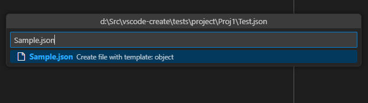
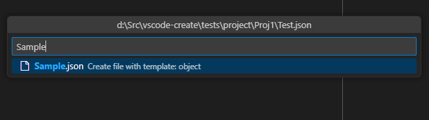
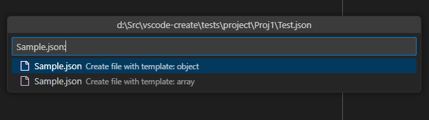
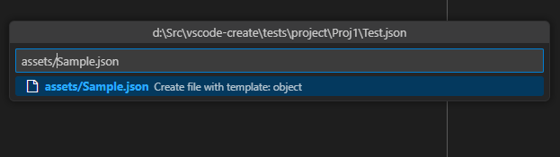

# vscode-create(dev branch)

## Overview

**Vs Code Create** is a simple extension for quickly creating files and folders in VS Code with template support

## Features
* Quick file creation via hotkey(Ctrl+A by default) by Explorer or Editor
* Single step quickpick input for all operations
* Files are created relative to the current path
* Automatically create child folders if they do not exist
* Ability to create folders
* Ability to create templates for files
* Support for multi-root workspaces

## Usage

Press Ctrl+A on Editor or File Explorer. Start typing a new file name and press Enter to create the file.

Depending on where the command was called, it will be determined which folder will be the root for creating a new file/folder. There are two possible options::
* **The command is called when the editor is in focus.** In this case, the root folder will be the folder of the currently open file
* **The command is called when the file explorer is in focus.** In this case, if a folder is in focus, it will be considered the root. If a file is in focus, the parent folder will be taken as the root

This extension allows you to create files and folders in various ways. The result depends on the user's actions. When entering new characters, a dialog box offers options for action. Below are some examples:

## What's next
For a more complete description of how it works and how it can be configured, read the [documentation](./docs/main.md)